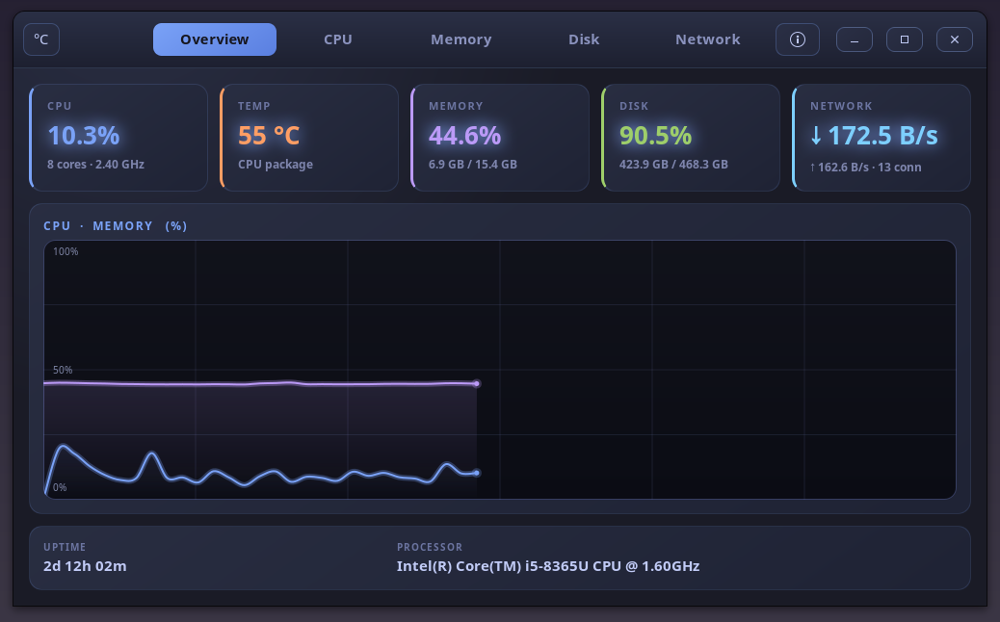

<div align="center">

# PULSE

**A unified, real-time monitor for the whole machine — written in C++ with a
GTK4 interface and a Tokyo Night dark theme.**

[](https://github.com/effjy/pulse/releases)
[](LICENSE)
[](https://en.cppreference.com/)
[](https://www.gtk.org/)
[](https://www.gnu.org/software/make/)
[](https://www.kernel.org/)

</div>

`pulse` brings the whole machine into one window. Once a second it reads the
kernel's `/proc` and `/sys` interfaces to show live **CPU** load (total and
per-core), **CPU temperature** in °C or °F, **load averages** and **frequency**,
**RAM & swap** usage with a breakdown, **per-filesystem disk** usage with live
read/write **I/O throughput**, and **network** up/down speed with active
**connection** counts. Five tabs, smooth Cairo graphs, and a Tokyo Night theme.

It assembles and extends the author's earlier single-purpose tools —
[`diskmon`](https://github.com/effjy/diskmon),
[`usage`](https://github.com/effjy/usage),
[`connmon`](https://github.com/effjy/connmon) and
[`ram`](https://github.com/effjy/ram) — into one cohesive dashboard.

Author: **Jean-Francois Lachance-Caumartin**

## Screenshot

<div align="center">



</div>

## Features

- **Overview** — at-a-glance summary cards for CPU, temperature, memory, disk
  and network, a combined CPU·memory graph, system uptime and processor model
- **CPU** — total utilisation graph, per-core load bars, current frequency,
  package temperature, and 1 / 5 / 15-minute load averages
- **Temperature** — live CPU package temperature, toggle between **°C and °F**
  from the header bar (prefers `coretemp` / `k10temp`, falls back to thermal zones)
- **Memory** — RAM usage graph with a Used / Cache / Available / Swap breakdown
- **Disk** — live read/write I/O throughput graph plus per-filesystem usage bars
- **Network** — auto-detected default interface, down/up throughput graph,
  active TCP connection count, and per-session totals
- Horizontal, tab-based layout sized to fit on small (1366×768) screens
- **System tray** — closing or minimizing the window keeps Pulse monitoring in
  the tray (StatusNotifierItem over D-Bus); click the icon or its menu to restore
- Single global icon used by the window, taskbar, tray, and About dialog
- No dependencies beyond GTK4; reads only `/proc` and `/sys`, no root required

## Prerequisites

You need a C++17 compiler, `make`, `pkg-config`, and the GTK4 development
headers.

**Debian / Ubuntu**
```sh
sudo apt install build-essential pkg-config libgtk-4-dev
```

**Fedora**
```sh
sudo dnf install gcc-c++ make pkgconf-pkg-config gtk4-devel
```

**Arch / Manjaro**
```sh
sudo pacman -S base-devel gtk4
```

## Build

```sh
git clone https://github.com/effjy/pulse.git
cd pulse
make
```

This produces the `pulse` binary in the project directory. Run it straight from
there with `./pulse`.

## Install

```sh
sudo make install     # binary, .desktop entry, and icons (256px + scalable)
```

`make install` copies the binary to `/usr/local/bin`, installs the `.desktop`
launcher, places the icon under `/usr/share/icons/hicolor/...`, and refreshes
the icon cache so the window, taskbar, and About dialog all resolve `pulse`.
After this you can launch **Pulse** from your application menu.

To remove everything:

```sh
sudo make uninstall
```

## Usage

Launch from your application menu (after installing) or from a terminal:

```sh
pulse            # if installed
./pulse          # from the build directory
```

No root privileges are required — `pulse` only reads `/proc` and `/sys`.

- **Switch tabs** from the header bar: Overview · CPU · Memory · Disk · Network.
- **Toggle temperature units** with the **°C / °F** button at the top-left.
- **Watch the graphs** — every page draws a smooth, auto-scaling Cairo graph;
  series are colour-coded (green = read / orange = upload, etc.).
- **About** — click the ⓘ button in the header bar for version, author and
  license info.
- **Tray** — when a system tray is running, closing or minimizing the window
  hides Pulse to the tray instead of quitting; it keeps collecting data in the
  background. Left-click the tray icon (or its **Show Pulse** menu entry) to
  bring the window back, and **Quit Pulse** to exit. If no tray is present the
  window simply closes as usual.

All values refresh once per second.

## License

Released under the [MIT License](LICENSE).
